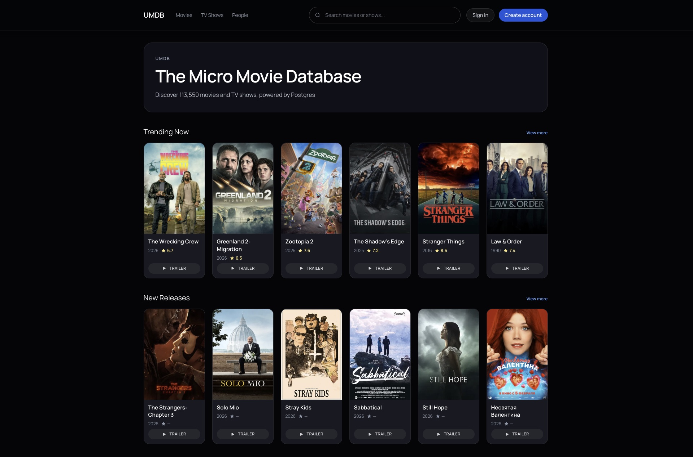

# UMDB - Micro Movie Database

UMDB is a small movie database similar to IMDb for movie search and recommendations. I
made it to experiment with Postgres full-text search and pgvector. Backend is a Java
Spring Boot API, frontend is a React SPA.

## Demo

Try it out at [umdb.submodular.ai](https://umdb.submodular.ai).

## Running

To run the app locally, you'll need Docker, Java (21+) and Node.

1. Start Postgres `docker compose up -d`
2. Start the backend `cd backend && ./mvnw spring-boot:run`
3. Start the frontend `cd frontend && npm install && npm run dev`
4. Visit `http://localhost:5173`

A small movie dataset is automatically loaded on startup. More data
can be downloaded from [The Movie Database](https://www.themoviedb.org/) API using the
Python scripts in `scripts/`.

## Notes

The frontend was written pretty quickly using the new Codex app with minimal prior React
knowledge, likely somewhat of a dumpster fire.

